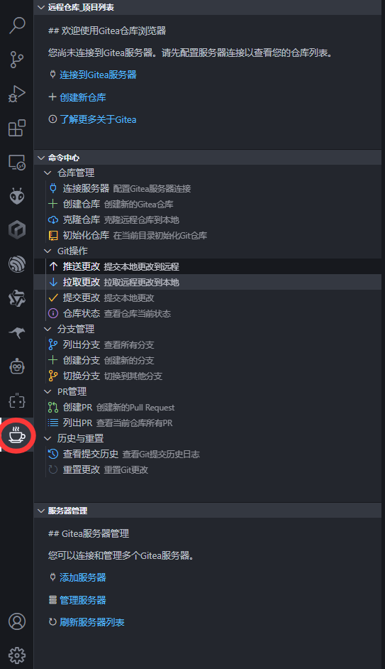

# Gitea Connector




> 上图为 Gitea Connector 插件在 VSCode 中的主要功能界面，包括：
>
> - 远程仓库项目列表
> - 命令中心（仓库管理、Git 操作、分支管理、PR 管理、历史与重置）
> - 服务器管理

---

## 当前版本

- 版本号：**2.0.19**
- 发布时间：2024-06

---

## 简介

Gitea Connector 是一款专为 VSCode 打造的 Gitea 服务器管理插件，支持多服务器、多仓库、分支、PR、历史等一站式操作，极大提升个人与团队的 Git 协作效率。

---

## 功能列表

### 🚀 多服务器管理

- 支持添加、切换、删除多个 Gitea 服务器
- 服务器信息本地加密存储，安全可靠
- 服务器管理视图，操作直观

### 📦 仓库管理

- 创建新仓库（支持私有/公开设置）
- 远程仓库一键克隆到本地（支持目录选择）
- 初始化本地仓库并可自动创建远程仓库
- 删除远程仓库（双重确认，安全防误删）
- 仓库类型（私有/公开）图标直观区分

### 🔧 Git 操作

- 一键推送、拉取、提交更改
- 推送时弹窗显示详细进度与分支信息
- 查看仓库当前状态（分支、文件变更、未跟踪、重命名等）

### 🌿 分支管理

- 列出所有分支，当前分支高亮显示
- 创建新分支
- 快速切换分支

### 🔀 PR 管理

- 创建 Pull Request（支持标题、描述、目标分支输入）
- 列出所有 Pull Requests，状态一目了然

### 🕓 历史与重置

- 查看提交历史日志
- 重置到指定历史提交（支持软/混合/硬重置）

### 🖥️ 友好用户界面

- 命令中心分组清晰，操作按钮美观
- 友好的弹窗输入与确认对话框
- 全中文提示，极易上手

---

## 使用方法

1. **连接 Gitea 服务器**
   - 命令面板执行 `MyGit: Connect to Gitea Server`，输入服务器名称、地址和访问令牌。
   - 服务器管理面板可添加、切换、删除服务器。
2. **仓库管理**
   - 创建仓库：`MyGit: Create Repository`，输入名称、描述、可见性。
   - 克隆仓库：点击仓库列表克隆图标或 `MyGit: Clone Repository`，选择本地目录。
   - 初始化仓库：`MyGit: Initialize Git Repository`，可自动创建远程仓库并关联。
   - 删除仓库：仓库列表点击红色删除图标，双重确认后删除。
3. **Git 操作**
   - 推送更改：`MyGit: Push Changes`，支持进度显示。
   - 拉取更改：`MyGit: Pull Changes`。
   - 提交更改：`MyGit: Commit Changes`，输入提交信息。
   - 查看状态：`MyGit: Show Repository Status`，弹窗展示详细状态。
4. **分支管理**
   - 列出分支：`MyGit: List Branches`。
   - 创建分支：`MyGit: Create Branch`，输入新分支名称。
   - 切换分支：`MyGit: Switch Branch`，选择目标分支。
5. **PR 管理**
   - 创建 PR：`MyGit: Create Pull Request`，输入标题、描述、目标分支。
   - 列出 PR：`MyGit: List Pull Requests`。
6. **历史与重置**
   - 查看提交历史：`MyGit: 查看提交历史`。
   - 重置更改：`MyGit: 重置更改`，选择历史提交和重置类型。

---

## 版本管理

- **2.0.19**
  - 命令中心所有命令项的鼠标悬停气泡提示改为英文
  - 细节优化，保持模块化与注释完善
- **2.0.18**
  - 推送时支持进度显示，README 增加功能演示图，细节优化
- 2.0.17 及更早版本：详见历史记录

---

## 安装

1. 下载最新的 VSIX 文件（如 `gitea-connector-2.0.19.vsix`）
2. VSCode 扩展面板右上角菜单选择"从 VSIX 安装" 或将 VSIX 文件拖拽到 VSCode 扩展面板中。
3. 或命令行安装：
   ```bash
   code --install-extension gitea-connector-2.0.19.vsix
   ```

---

## 配置

在 VSCode 设置中可配置：

- `gitea.servers`：Gitea 服务器配置列表
- `gitea.defaultVisibility`：新建仓库默认可见性（private/public）
- `gitea.multiRepoSupport`：是否启用多仓库管理
- `gitea.serverUrl`、`gitea.token`：兼容旧版单服务器配置

---

## 特性展示

- **多服务器管理**：可添加、切换和删除多个 Gitea 服务器
- **仓库可见性选择**：创建仓库时可选私有/公开
- **直观仓库标识**：私有仓库红色图标，公开蓝色图标
- **便捷克隆操作**：仓库项右侧克隆按钮，目录选择
- **安全删除操作**：红色删除按钮+双重确认
- **推送进度显示**：推送时弹窗显示进度与分支

---

## 贡献

欢迎提交 Issue 和 Pull Request！

---

## 许可证

MIT
